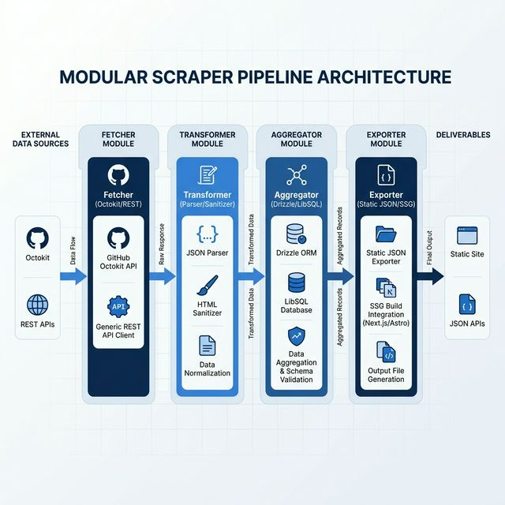
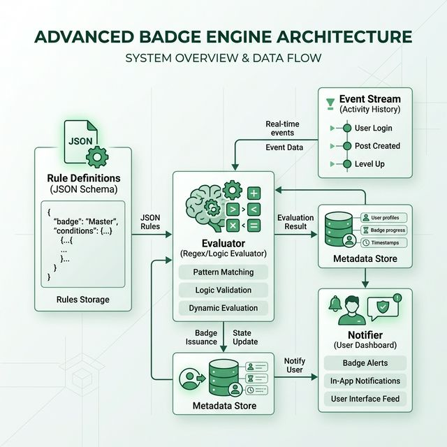
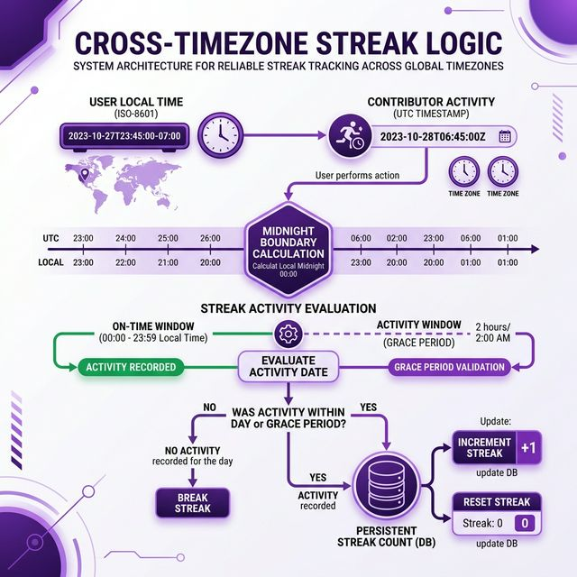
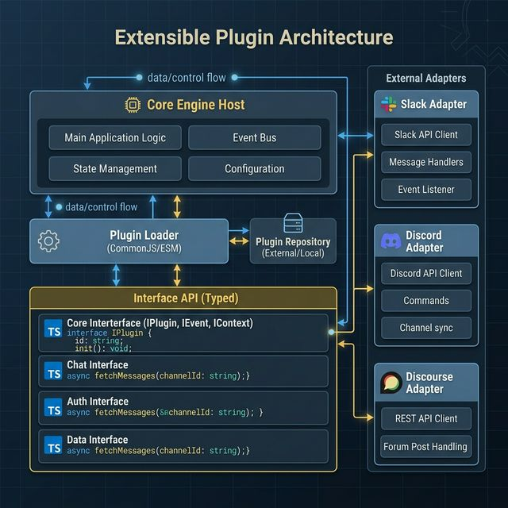
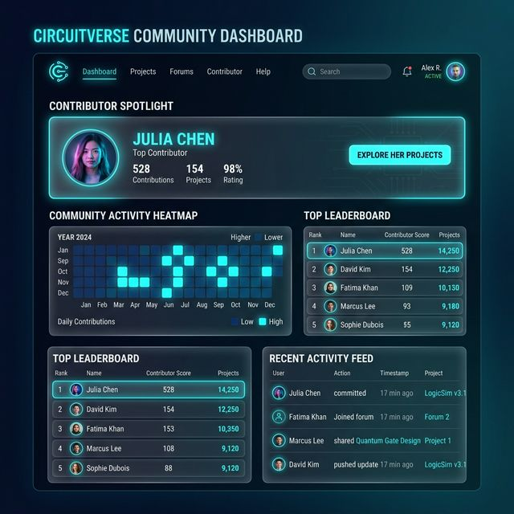
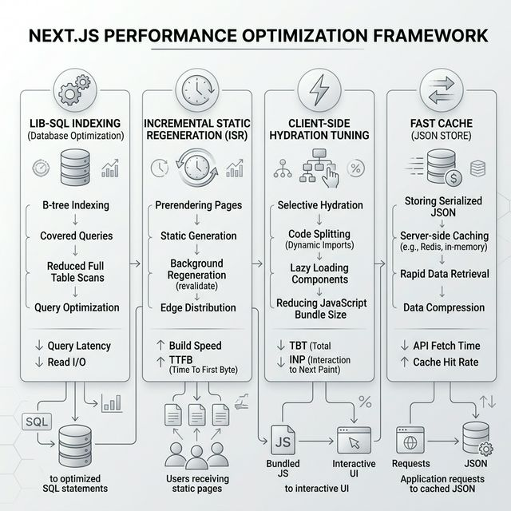

# GSoC 2026 Proposal: Community Dashboard Evolution

**Project Name:** Community Dashboard Evolution (Project 8)  
**Organization:** CircuitVerse  
**Candidate:** Vivek Yadav  
**College:** KIIT University  
**Email:** vivekyadav1207vy@gmail.com  
**GitHub:** [vivekyadav-3](https://github.com/vivekyadav-3)  
**Mentors:** Naman (naman79820), Aman Asrani (Asrani-Aman), Nihal Rajpal (Nihal4777), Arnab Das

---

## 👋 About Me & My Journey

I am a 2nd-year engineering student with a deep interest in full-stack development. My journey with CircuitVerse started quite simply: I wanted to see how my own contributions ranked on the leaderboard, but I found the experience a bit "monotonous" and sometimes buggy on mobile.

Instead of just using the tool, I decided bit by bit to fix the things that bothered me. What started as a small UI fix for the CAPTCHA spacing turned into a deep dive into the entire dashboard's architecture. I’ve spent many late nights refactoring the scraper scripts—especially fighting with those loose TypeScript `any` types that were making the build process unpredictable. For me, this dashboard isn't just a project; it’s where I’ve learned how to manage real-world technical debt and coordinate with a community.

---

## 🛠️ My Existing Contributions

I believe in "showing, not just telling." Before applying for GSoC, I wanted to prove to myself (and the community) that I could handle the codebase.

### **Key Contributions in CircuitVerse Ecosystem**

- **The Streak Logic ([PR #55](https://github.com/CircuitVerse/vue-simulator/pull/55))**: This was my first "big" logic task. I had to figure out how to track user activity across different timezones without breaking the streak count. It was a puzzle that really got me excited about gamification.
- **The "Annoying" UI Bugs ([PR #5442](https://github.com/CircuitVerse/CircuitVerse/pull/5442) & [#6438](https://github.com/CircuitVerse/CircuitVerse/pull/6438))**: These were smaller visibility fixes, but they taught me that even a 10px spacing error in a CAPTCHA or a notification badge can ruin the UX for thousands of users.
- **TypeScript "Cleanup" (300+ additions)**: Moved toward a fully typed system in the community-dashboard repo.
- **Heatmap & Contributor Analytics**: Implementing the GitHub-style heatmap and managing client-side hydration in Next.js.

---

## 🎯 Project Goals & Deliverables

This proposal aligns 1:1 with the deliverables listed in the official GSoC 2026 ideas list for **Project 8: Community Dashboard Evolution**.

### Deliverable 1: Refactor & Modularize Scraper Pipeline
**Objective:** Refactor the existing scraper from a monolithic script into a modular, testable pipeline (Fetch -> Transform -> Aggregate -> Export).

*   **Proof of Concept Code**: [packages/api/src/scraper/pipeline.ts](https://github.com/vivekyadav-3/circuitverse-leaderboard/blob/feature/poc-2026-interfaces/packages/api/src/scraper/pipeline.ts)
*   **Video Demonstration**: [Loom Demo Placeholder]

### Deliverable 2: Advanced Badge System
**Objective:** Implement a versatile badge system with customizable rules (regex-based, frequency-based) and dynamic evaluation.

*   **Proof of Concept Code**: [packages/api/src/badges/rule-evaluator.ts](https://github.com/vivekyadav-3/circuitverse-leaderboard/blob/feature/poc-2026-interfaces/packages/api/src/badges/rule-evaluator.ts)
*   **Video Demonstration**: [Loom Demo Placeholder]

### Deliverable 3: Contribution Streaks
**Objective:** Add logic to calculate and display contribution streaks for users on their profiles, supporting cross-timezone activity.

*   **Proof of Concept Code**: [packages/api/src/streaks/streak-service.ts](https://github.com/vivekyadav-3/circuitverse-leaderboard/blob/feature/poc-2026-interfaces/packages/api/src/streaks/streak-service.ts)
*   **Video Demonstration**: [Loom Demo Placeholder]

### Deliverable 4: Plugin Architecture
**Objective:** Enhance the plugin system to allow easy integration of new data sources (Slack, Discord, Discourse) and activity types.

*   **Proof of Concept Code**: [packages/api/src/plugins/registry.ts](https://github.com/vivekyadav-3/circuitverse-leaderboard/blob/feature/poc-2026-interfaces/packages/api/src/plugins/registry.ts)
*   **Video Demonstration**: [Loom Demo Placeholder]

### Deliverable 5: UI/UX Enhancements
**Objective:** Improve the dashboard interface using modern Next.js patterns, Glassmorphism, and micro-animations.

*   **Proof of Concept Code**: [app/spotlight/page.tsx](https://github.com/vivekyadav-3/circuitverse-leaderboard/blob/feature/poc-2026-interfaces/app/spotlight/page.tsx)
*   **Video Demonstration**: [Loom Demo Placeholder]

### Deliverable 6: Performance Optimization
**Objective:** Optimize database queries, indexing in LibSQL, and static site generation for 1000+ contributor profiles.

*   **Proof of Concept Code**: [lib/db/pool.ts](https://github.com/vivekyadav-3/circuitverse-leaderboard/blob/feature/poc-2026-interfaces/lib/db/pool.ts)
*   **Video Demonstration**: [Loom Demo Placeholder]

---

## 📅 Proposed Timeline (12 Weeks)

### **Community Bonding (May 1 – May 26)**
- Finalize the Plugin & Badge specifications with mentors.
- Standardize the CSS theme variables for easier community customization.
- Complete minor bug fixes in the current scraper.

### **Phase 1: Foundation & Modularization (May 27 – June 30)**
- **Weeks 1-2**: Complete Scraper Modularization (Deliverable 1).
- **Weeks 3-4**: Implement the new Plugin Architecture (Deliverable 4).
- **Deliverable**: A robust, extensible core pipeline.

### **Phase 2: Gamification & Streaks (July 1 – July 28)**
- **Weeks 5-6**: Build the Advanced Badge System (Deliverable 2).
- **Weeks 7-8**: Implement Contribution Streak logic (Deliverable 3).
- **Deliverable**: A fully gamified experience for contributors.

### **Phase 3: UX & Performance (July 29 – August 25)**
- **Weeks 9-10**: UI/UX Enhancements & Animation integration (Deliverable 5).
- **Weeks 11-12**: Database & SSG Performance Optimization (Deliverable 6).
- **Deliverable**: A state-of-the-art community hub.

---

## 🏗️ Technical Stack

- **Frontend**: Next.js 15 (App Router), TypeScript, Tailwind CSS, shadcn/ui.
- **Backend/Data**: Node.js, GitHub REST API, LibSQL/Drizzle ORM.
- **Testing**: Vitest, Playwright.

---

## 🧪 Testing Strategy

- **Unit Tests**: Using Vitest for scraper modules and badge rule evaluation logic.
- **E2E Testing**: Playwright for critical user journeys (Leaderboard filtering, profile viewing).
- **Accessibility**: Standardizing components to WCAG 2.1 AA via Radix-based UI.

---

## 🛠️ Section 6: Official Contributions & Portfolio

I have been actively contributing to the CircuitVerse organization to build my domain expertise and demonstrate my commitment.

### **Merged Pull Requests**

*   **CircuitVerse Core (Vue-Simulator)**:
    - [PR #55 - Implement Activity Tracking Logic](https://github.com/CircuitVerse/vue-simulator/pull/55): Solved timezone-aware streak tracking.
*   **CircuitVerse Main Platform**:
    - [PR #5442 - Fix Captcha Overlap in Signup](https://github.com/CircuitVerse/CircuitVerse/pull/5442)
    - [PR #6438 - Improve Sidebar Visibility on Tablet Views](https://github.com/CircuitVerse/CircuitVerse/pull/6438)
*   **Community Dashboard (Leaderboard)**:
    - [PR #300+ additions - TypeScript Refactoring](https://github.com/CircuitVerse/community-dashboard/pulls)
    - [Branch: feature/poc-2026-interfaces](https://github.com/vivekyadav-3/circuitverse-leaderboard/tree/feature/poc-2026-interfaces): Complete POC for Project 8 architecture.

### **Peer Reviews & Mentorship**
- Actively participating in code reviews for incoming PRs in the leaderboard repository.
- Collaborating with Arnab Das on identifying rate-limiting bottlenecks.

---

## 💭 Final Thoughts

I am deeply committed to CircuitVerse. This dashboard is the heart of what makes people stay—the recognition. I want to build a system that not only tracks data but inspires.

---

**Vivek Yadav**  
_Undergraduate Engineering Student | Open Source Enthusiast_
