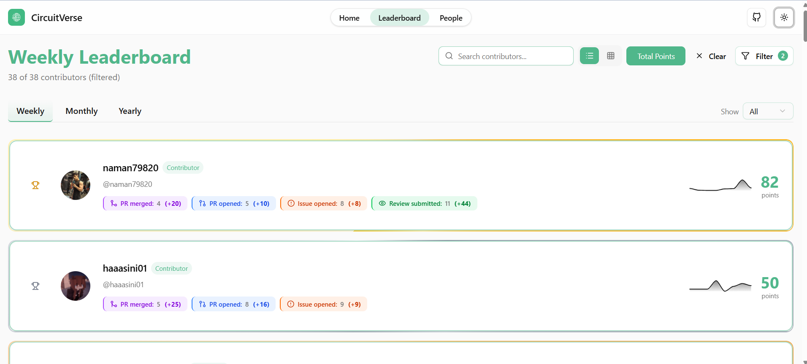
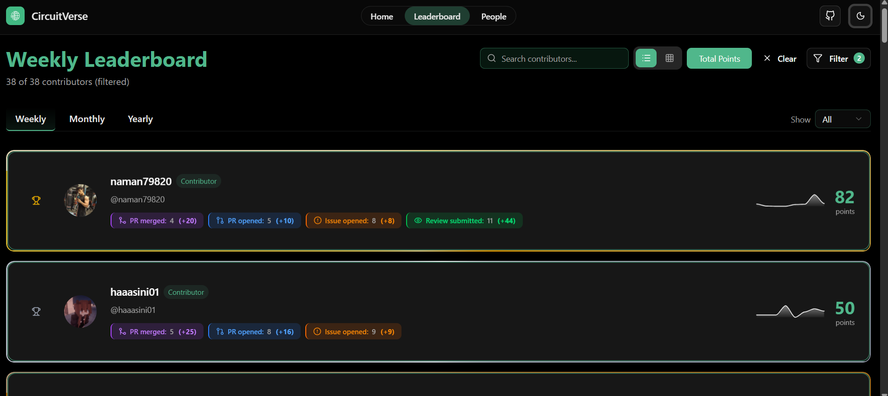
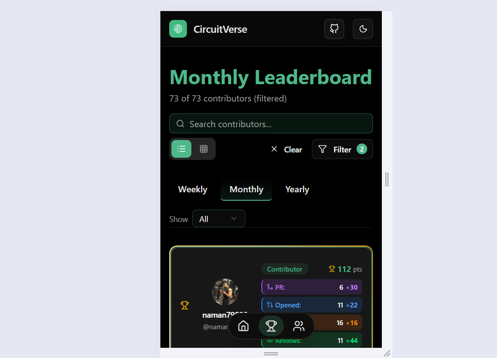
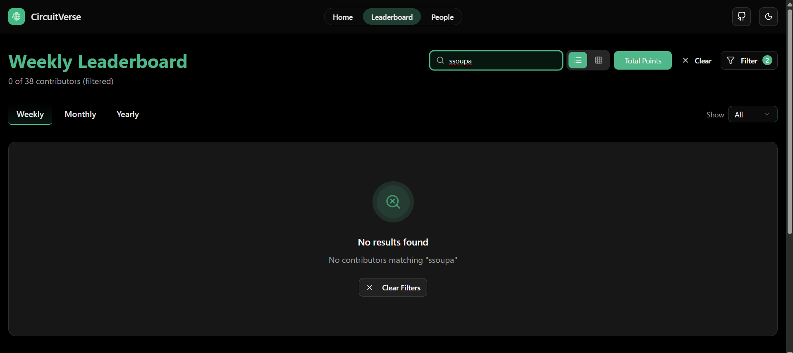

# GitHub Activity Leaderboard


---

## ✨ Features

- 📊 **Weekly, Monthly, and Yearly leaderboards**
- 🔍 **Search and filter contributors**
- 🎨 **Dark/Light mode support**
- 📱 **Mobile responsive**
- 🏆 **Top contributors by activity type**
- 📈 **Activity trend charts**

---

## 📸 Screenshots

### Leaderboard View (Light Mode)



### Leaderboard View (Dark Mode)



### Mobile Responsive View



### Empty State UI



---

## 🔗 Quick Links

- 🌐 [Live Demo](https://cv-community-dashboard.netlify.app/)
- 🐛 [Report Bug](https://github.com/CircuitVerse/community-dashboard/issues/new)
- 💡 [Request Feature](https://github.com/CircuitVerse/community-dashboard/issues/new)

---

## 🏁 Overview

This project powers the **CircuitVerse Leaderboard**, which ranks contributors based on their GitHub activity such as:

- Pull Requests opened
- Pull Requests merged
- Issues opened

👉 **GitHub Actions periodically fetch GitHub data and generate static JSON files**, which are then committed to the repository and served directly by the frontend.

This approach is:

- Fast
- Reliable
- Rate-limit friendly
- Easy to maintain

---

## 🧠 Key Design Decisions

- ✅ Static JSON generated by GitHub Actions
- ✅ Frontend only reads pre-generated data
- ✅ Bots are excluded from scoring

---

## 🧱 Tech Stack

- **Next.js (App Router)**
- **TypeScript**
- **GitHub Actions**
- **GitHub REST API**
- **Tailwind CSS**
- **Recharts** (for data visualization)

---

## ✨ Features

### 🔥 Activity Heatmap (GitHub-Style)

**Feature Description:**
Implemented a GitHub-style activity heatmap for the CircuitVerse Leaderboard, visualizing 365 days of contributor activity with interactive tooltips and color-coded intensity levels. This feature enhances user engagement and provides motivational feedback similar to GitHub's contribution graph.

**Technical Highlights:**
Built a performant React component with data aggregation, interactive tooltips, responsive design, and dark mode support. Optimized performance using React.useMemo and maintained strict TypeScript type safety throughout.

**Key Features:**

- 📅 365-day contribution view
- 🎨 Color-coded intensity levels (0-4)
- 🖱️ Interactive tooltips (date, count, points)
- 📱 Responsive design
- 🌓 Dark mode support
- ⚡ Performance optimized with React.useMemo
- ♿ Accessible with ARIA attributes

**View it in action:** Visit any contributor profile page to see their activity heatmap!

---

## 📁 Project Structure (relevant parts)

```
app/
  leaderboard/
    page.tsx
    [period]/
      page.tsx
  api/
    people/
      route.ts
  layout.tsx

components/
  Leaderboard/
    LeaderboardView.tsx
    ActivityTrendChart.tsx
    stats-card/
      active-contributors.tsx
      activity-line-card.tsx
      activity-types.tsx
  people/
    ContributorCard.tsx
    ContributorDetail.tsx
    PeopleGrid.tsx
    SearchFilter.tsx

lib/
  leaderboard.ts
  db.ts
  utils.ts

public/
  leaderboard/
    week.json
    month.json
    year.json
    recent-activities.json

scripts/
  generateLeaderboard.ts
  get-theme.ts

types/
  db.ts

.github/
  workflows/
    leaderboard.yml
```

---

## 🧮 Scoring Model (current)

| Activity     | Points |
| ------------ | ------ |
| PR Merged    | 10     |
| PR opened    | 5      |
| Issue opened | 2      |
| PR reviewed  | 4      |

> PR reviews and label triaging are intentionally excluded for now and will be added via separate issues.

---

## ⏱ Update & Refresh Model

The leaderboard is updated automatically using **GitHub Actions**.

- Runs every **24 hours**
- Can be triggered manually

---

## ⚙️ How It Works

```text
GitHub Actions
      |
      v
Fetch GitHub API data
      |
      v
Generate JSON files
(public/leaderboard/*.json)
      |
      v
Commit JSON back to repo
      |
      v
Next.js frontend reads JSON
```

---

## 📄 Generated JSON Format

```json
{
  "period": "month",
  "updatedAt": 1734090000000,
  "entries": []
}
```

---

## 🚫 Bot Filtering

Bot accounts such as `dependabot[bot]`, `github-actions[bot]`, and any user ending with `[bot]` are excluded.

---

## 🔐 Environment Setup (for local data generation)

Create a `.env.local` file in the project root and add:

```env
GITHUB_TOKEN=ghp_your_token_here
```

This token is **only required** if you want to fetch and generate leaderboard data locally.

---

## 🚀 Local Development

```bash
npm install
npm run dev
```

---

## 🧪 Generate Data Locally (optional)

```bash
export GITHUB_TOKEN=ghp_your_token_here
npx tsx scripts/generateLeaderboard.ts
```

---

## 🤝 Contributing

1. Fork the repo
2. Create a feature branch: `git checkout -b feat/xyz`
3. Commit with conventional messages
4. Open a PR
   Please keep changes small and add context in PR description. For questions, Contact on slack.

## Demo Site

[https://cv-community-dashboard.netlify.app/](https://cv-community-dashboard.netlify.app/)
